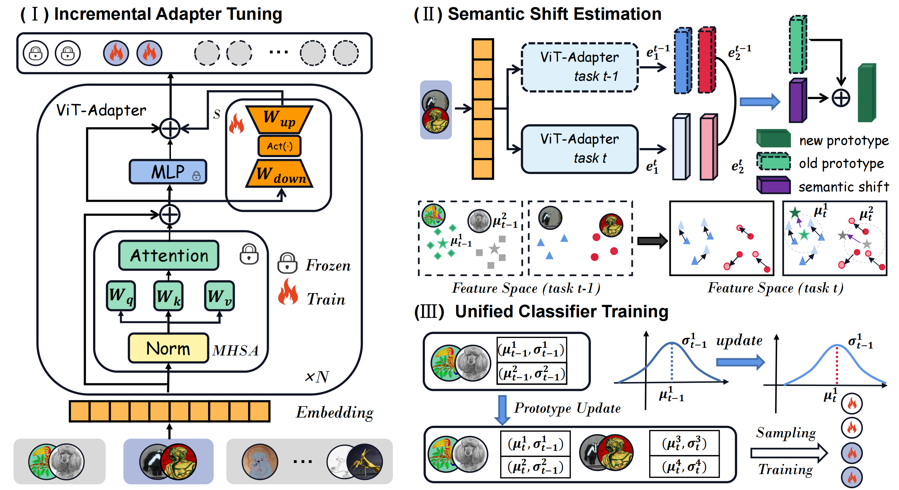

# Semantically-Shifted Incremental Adapter-Tuning is A Continual ViTransformer
<div align="center">

<div>
    <a href='' target='_blank'>Yuwen Tan</a><sup>1</sup>&emsp;
    <a href='' target='_blank'>Qinhao Zhou</a><sup>1</sup>&emsp;
    <a href='https://scholar.google.com.hk/citations?hl=zh-CN&user=-D5k5ioAAAAJ&view_op=list_works' target='_blank'>Xiang Xiang</a><sup>1</sup>&emsp;
    <a href='' target='_blank'>Ke Wang</a><sup>2</sup>&emsp;
    <a href='' target='_blank'>Yuchuan Wu</a><sup>2</sup>&emsp;
    <a href='' target='_blank'>Yongbin Li</a><sup>2</sup>
    
</div>
<div>
<sup>1</sup>School of Artificial Intelligence and Automation, Huazhong University of Science and Technology&emsp;

<sup>2</sup>Alibaba Dharma Institute&emsp;
</div>
</div>

The code repository for "[Semantically-Shifted Incremental Adapter-Tuning is A Continual ViTransformer](https://arxiv.org/abs/2403.19979)" in PyTorch.  If you use any content of this repo for your work, please cite the following bib entry: 

	@article{tan2024semantically,
  	title={Semantically-Shifted Incremental Adapter-Tuning is A Continual ViTransformer},
  	author={Tan, Yuwen and Zhou, Qinhao and Xiang, Xiang and Wang, Ke and Wu, Yuchuan and Li, Yongbin},
  	journal={arXiv preprint arXiv:2403.19979},
  	year={2024}
	}

    


## Updates

[02/2024] Code has been released.

## Abstract
Class-incremental learning (CIL) aims to enable models to continuously learn new classes while overcoming catastrophic forgetting. The introduction of pre-trained models has brought new tuning paradigms to CIL. In this paper, we revisit different parameter-efficient tuning (PET) methods within the context of continual learning. We observe that adapter tuning demonstrates superiority over prompt-based methods, even without parameter expansion in each learning session. Motivated by this, we propose incrementally tuning the shared adapter without imposing parameter update constraints, enhancing the learning capacity of the backbone. Additionally, we employ feature sampling from stored prototypes to retrain a unified classifier, further improving its performance.  We estimate the semantic shift of old prototypes without access to past samples and update stored prototypes session by session. Our proposed method eliminates model expansion and avoids retaining any image samples. It surpasses previous pre-trained model-based CIL methods and demonstrates remarkable continual learning capabilities. Experimental results on five CIL benchmarks validate the effectiveness of our approach, achieving state-of-the-art (SOTA) performance. 
<p></p>


<div align="center">

</div>
<p></p>

<div>
We use adapter without parameter limitation as our baseline, compared with other PETuning method, we find adapter performs best in balancing the performance of old and new classes. We further train the classifier by sampling features with Gaussian samples, which improves the performance of the incremental process. During the construction of the distribution, we apply semantic bias correction to the prototype of each feature within each class.
</div>

<p></p>

<div>
The following table shows the results of the main experiment.
Note: Results may vary slightly depending on the type and number of graphics cards used, but the overall trend remains consistent.
</div>

<div align="center">

</div>


## Requirements
### Environment
1. [torch 1.11.0](https://github.com/pytorch/pytorch)
2. [torchvision 0.12.0](https://github.com/pytorch/vision)
3. [timm 0.6.12](https://github.com/huggingface/pytorch-image-models)


### Dataset
We provide the processed datasets as follows:
- **CIFAR100**: will be automatically downloaded by the code.
- **CUB200** **ImageNet-R** **ImageNet-A**  **VTAB**: Reference [Revisiting](https://github.com/zhoudw-zdw/RevisitingCIL)


These subsets are sampled from the original datasets. Please note that we  do not have the right to distribute these datasets. If the distribution violates the license, I shall provide the filenames instead.

You need to modify the path of the datasets in `./data/data.py`  according to your own path.

## Training Scripts
Please follow the settings in the `exps` folder to prepare your json files, and then run:

```
python main.py --config ./exps/[configname].json

for imageneta:
python main.py --config ./exps/adapter_imageneta.json
for imagenetr:
python main.py --config ./exps/adapter_imagenetr.json
for cifar224:
python main.py --config ./exps/adapter_cifar224.json
for cub200:
python main.py --config ./exps/adapter_cub.json

```


## Acknolegment
This repo is based on [RevisitingCIL](https://github.com/zhoudw-zdw/RevisitingCIL) and [PyCIL](https://github.com/G-U-N/PyCIL).

The implemenations of parameter-efficient tuning methods are based on [VPT](https://github.com/sagizty/VPT), [AdaptFormer](https://github.com/ShoufaChen/AdaptFormer), and [SSF](https://github.com/dongzelian/SSF).

Thanks for their wonderful work!!!

## Correspondence
